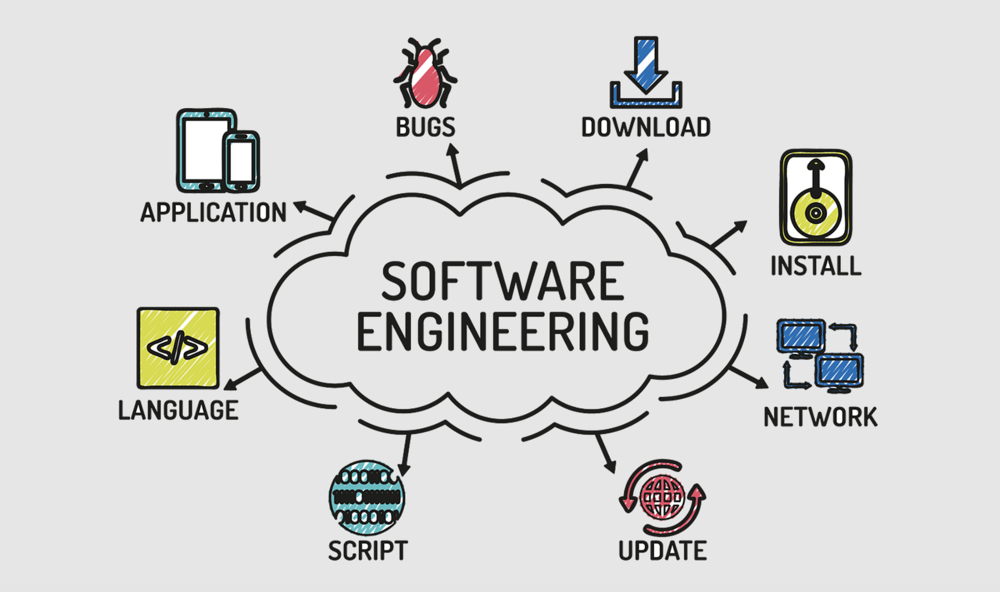

*My personal experience of working on software engineering projects through ICS 414*

    

 

## **Retooling My Skill Set**

Coming into this class of Software Engineering II (ICS414), I wasn’t really sure what to expect. I wanted to improve my software development skills, organizational workflows, and general project management practices by taking this class. I also wanted to gain more experience with working on projects that were not only bigger (in the sense of scale, such as team size, amount of time to work on the project, etc) but also meaningful in that it could produce real-life applications. However, it has been a couple of years since I took Software Engineering I (ICS 314), so I was originally worried about how much of the skill sets and practices I would remember from ICS 314, as well as how well I would adjust in working in bigger groups.  Throughout the semester, I was able to get comfortable with both of these aspects and learn more about my personal growth/capabilities in software engineering. Therefore, I would say that my experience in ICS 414 was fairly positive. During this past Fall 2025 semester, I was able to work on a technical software group project to help improve both my technical and soft skills. I enjoyed the environment that this class brought about from both working with my team and tackling new challenges of the project that we were assigned.

 

## **New Semester, New Team**

 

Over the course of the semester, I realized that working well with my group members is one of the most important things to focus on while working on the project. This is especially true for bigger group projects that involve longer timelines to integrate and implement. I would say that team work influences a significant impact on one’s overall performance and contribution in a project, as the team environment as a whole can make or break one’s experience with group work. It can also shift the mentality of choosing to pursue software engineering as a career path, or building software projects in general. From my experience this semester, I would say that I got along with most of my teammates. It was a little challenging to get along with everyone in the group at first. However, I still liked working in my group mainly because I was able to get comfortable around them fairly quickly, which made it easy for me to talk to them and communicate our ideas effectively. 

#### Successes:

As a group, I thought that we did a good job of clarifying any confusing or misleading ideas that we had for the project. We would often message each other in the group discord whenever there were certain bugs that prevented us from working in specific branches. We would then collectively contribute to come up with solutions and fix those problems. Our group also had some programming conflicts when pulling from and resetting the database on the server side. To fix this, we ended up creating separate branches of the database through a NeonDB Postgres serverless platform, which I thought was one of the good workarounds that our group figured out together. One branch was designed for production, which would be utilized for our deployed app, while other branches were for our development during testing. In this way, each of us could use separate branches of the database without overwriting each other’s work and needing to constantly reseed the database to its default values. As a result, I liked the problem solving skills that our group collectively contributed to. 
	
#### Challenges: 

With this being said, there were some times when communicating with my group was a bit challenging. A couple of members didn’t really talk in the discord server when it came to speaking at meetings or giving updates on their progress throughout the semester. This made it a little difficult to keep track of the tasks that everyone was working on. It also made it hard to make sure if everyone was up to date or on pace to finish their task on time, so that we can reach our goals before the next milestone presentation. 

Furthermore, the lack of communication at times also made it hard to work on some project tasks, especially if some GitHub issues relied or were dependent on each other (i.e. a Github issue could only be done if another was finished). Our group tried to prevent these types of problems from occurring by making GitHub issues as separate as possible, so that all of us could work concurrently and independently. Although some communication issues might have caused some confusion when I was working, all of my group members still completed their assigned issues for each milestone and contributed to the project in meaningful ways, which was good. I’m very thankful that I was able to work in a team that was determined to be productive and get a lot of work done, especially when progress needed to be made and shown when presenting for milestones. 

### Improving Soft Skills & Team Bonding

Over time, throughout the semester, everyone’s schedules became more busy with school and we began to prioritize working on our other computer science classes or other coding projects such as the HACC. This caused us to not make as much progress on our project as we would’ve liked, which made it hard to communicate with other group members as mentioned before. However, this helped me to step out of my comfort zone when it came to being a more vocal and efficient team member. During our weekly check-in meetings, I would speak up to moderate and host the meeting and check in with everyone else’s progress. This not only allowed me to stay on task and make some contributions each week as a team member, but it also enabled me to understand the vision of the project as a whole. I would also ask questions with team members individually via Discord whenever I didn’t completely understand specific Github issues. This allowed me to not only stay on task, but also continue to add little contributions to our project as the semester went on.

Our group got to meet together outside-of-class and have a couple of hangouts throughout the semester that weren’t related to the project. This included going to birthday dinners and doing escape rooms together. Having these team bonding hangouts was good for us to become closer and refresh the burden of constantly focusing on the project together. It also helped me understand the “humanity” aspect of group projects. These activities were a good reminder that all of my other group members have lives outside of just working on the project together. It further allowed me to realize that it is important to know your roles, responsibilities, and assigned tasks not just in a group project but in a working environment team in general.

 

## Issue-Driven Project Management (IDPM) via GitHub 

Another main thing that I  learned through this course is the importance of time management and project organization. This semester-long project allowed me to practice my time/project management effectively because I got to experience the routine of agile and scrum methodologies. The main downside to this was that the repetitive nature of going through this same process biweekly started to make me feel burnt out. I started to slack off and become a little lazy on focusing on my Github issues/tasks. I also slowly began to lose motivation to continue working on the project as the semester progressed. However, getting to experience IDPM enhanced my workflows to achieve such tasks more quickly and efficiently. For example, I felt that the biweekly sprints or milestones helped our team plan out and set deadlines accordingly. Code reviews also allowed us to organize our project structure and make our code more readable.

### Workflows & Code Reviews

I became very familiar with using Github as a platform for IDPM, as it was mainly used to help our group write new issues, keep track of issues via project boards, write code reviews, and review branches of other team member’s code through pull requests. Creating issues for weekly code reviews also helped me learn how to document things well and write more readable code. As a result, this improved my organizational workflows in both programming and testing, such as adding acceptance tests, checking for ESLint errors, setting up continuous integration, etc. Furthermore, going through biweekly milestones allowed me to better organize and manage my tasks via Github issues. I was also able to plan things out ahead of time and spread my work out more evenly, due to these milestones. In the future, I would like to continue these organizational practices by using more of Github’s features, or maybe finding other tools that can help enhance project management.

This was one of the first times where I had to do code reviews on a consistent basis, so I was unsure how to do them. It felt very unnatural at first, but as I became more familiar with them and started to conduct code reviews faster, I realized how important it is to document/comment sections of your code. It not only helps you understand what you were trying to accomplish after picking up from where you left off, but it also enables other people to understand the code that you wrote when they look at it. Code reviews have thus made me more aware and efficient in writing cleaner code that is easier to read or understand, especially when code is duplicated. This stems from the idea of making sure that all team members are on the same page. 

Adding on to this, it also relates to the common goal of building a meaningful product (MVP) that both our team is proud of and the sponsor is satisfied with.  This emphasizes the importance of understanding the sponsor needs and aligning our team goals with the goals of the sponsor. Although I did not get to fully experience this in the course, I’m glad that I got a some practice of what the experience might be like via milestone presentations and suggestion improvements from the professor.

_Taking ICS 414 allowed me to learn how to conduct the following key tasks effectively for project management:_

* Writing  **unit/acceptance tests**  to debug edge cases in code from the backend/frontend sides
* Creating  **GitHub boards**  for milestones
* Setting up  **GitHub issues**  
* Setting up  **code reviews**  and adding comments for the files to review (in the code review)
* Assigning issues to specific boards for milestones and organizing them by  **issue types**   
  * (i.e. Code review issue or milestone issue)
* Updating our  **organization home page**  for the project on a weekly basis

### Weekly Meetings

Slowly over time, less team members would show up to our weekly scheduled meetings that were set at the beginning of the semester (Mondays during class time). Looking back, we could have changed meeting times to accommodate everyone's schedule. As a result, I wasn’t as prepared as I would’ve liked to have been for these meetings. It became more difficult to present my “progress” during these weekly check-in meetings and talk about next steps for our project. Meetings which once started around 30 minutes only lasted around 5-10 minutes towards the end of the semester due to few group mates showing up. There was also less and less to discuss during these meetings overtime. One of the main reasons for this was because our group had trouble figuring out what issues to add to our GitHub board in terms of improving the app. The project description that was presented by our professor was very open-ended, but also limited in scope, in terms of functional requirements, so the project itself got more difficult to progress. We weren’t too sure what kind of functionalities and UI designs could be integrated to enhance the project. 

 

## Learning a New Tech Stack

When I originally took ICS 314, I was only familiar with frameworks in Meteor, React, and JavaScript. I also mainly used MongoDB for user collections in databases. However, I was able to expand my knowledge in using other tech stacks this semester. This mainly included the following:
* **<mark>Programming in TypeScript</mark>**
* **<mark> nextJS and React w/ Bootstrap/Lucide frameworks</mark>**
* **<mark> Postgresql for databases</mark>**
* **<mark> Acceptance tests via Playwright</mark>**
* **<mark> Tailwind CSS styling</mark>**

During each milestone, I assigned myself a couple of issues relating to the UI of specific web pages that involved displaying inventory management and custom user recipes. As a result, I got to practice with building components using React and TypeScript, while becoming more familiar with the nextJS framework. I was also able to strengthen my technical skills in terms of using React hooks, state logic, and side effects to create more dynamic user interactions and interfaces. This was mainly done with control forms and other user inputs to help me learn how to enhance the overall UX of a web app.
One of the learning points I got out of this class was the importance of adapting and being flexible to situations in general. This mainly involves adjusting and getting more familiar with using tools for web and software development. Advancements in technology are rapidly advancing today, so it is important to adjust to these modern practices and workflows. Especially with AI advancements and vibe coding on the rise, learning new tools to enhance your skillset and refine your craft can help improve your effectiveness as a software engineer. 

## Final Thoughts

Overall, I found this class to be fairly easy, straightforward. It was not as intense as I imagined the course to be, but there are certain aspects that I definitely underestimated. I realized that the class requires a lot of self-discipline to keep yourself and other teammates accountable, in order to make sure you are constantly on the same page and continually making some progress on the project. The class can become overwhelming if you try to procrastinate on finishing issues for a milestone and try to get a bunch of work all at once (i.e. trying to finish about 2 weeks worth of tasks crammed into one night or a couple of nights). It is also “difficult” in the sense that there is a lot of leniency and flexibility with little accountability. In other words, ICS 414 is what you make of it. You can easily do well in this class by just doing work. However, I found that the motivation to do work varies week by week, milestone by milestone, depending on your teammates, the project, busy schedules, and other areas in your life. Therefore, consistency and having set schedules is key to being successful in software engineering. It is good to build habits of regularly dedicating specific time slots to focus on doing work. I also found that organization in software engineering is also key when you are picking up from you left off from an unfinished issue or task. Sometimes a wasted, unnecessary amount of time would be spent trying to figure out where I left. This included trying to remember which parts of the code I needed to add/fix/ debug, what more I needed to do from an unfinished issue, etc. mainly because I wasn’t as organized from documentation and other areas of the project.  The repetitive routine and nature on the course can make you feel lazy and burn out, causing you to slack off. Therefore, it is best to take things slowly in order to stay motivated. 

I still have a long way to go in my software engineering career, but ICS 414 was a good start for my experience in working in larger teams. It allowed me to understand how to distribute the workload of a bigger project and assign more roles to everyone part of the team, which is relevant or appropriate in real-life work environments. This class more so helped me learn about handling the social dynamics of group work rather than the actual technical aspects of a software project. This was helpful in a way, since it helped me to improve my project management and communication skills. I therefore look forward to seeing how I can apply all of the tools and practices that I accumulated and learned to my future software projects, in order to assist me in becoming a better software engineer.

