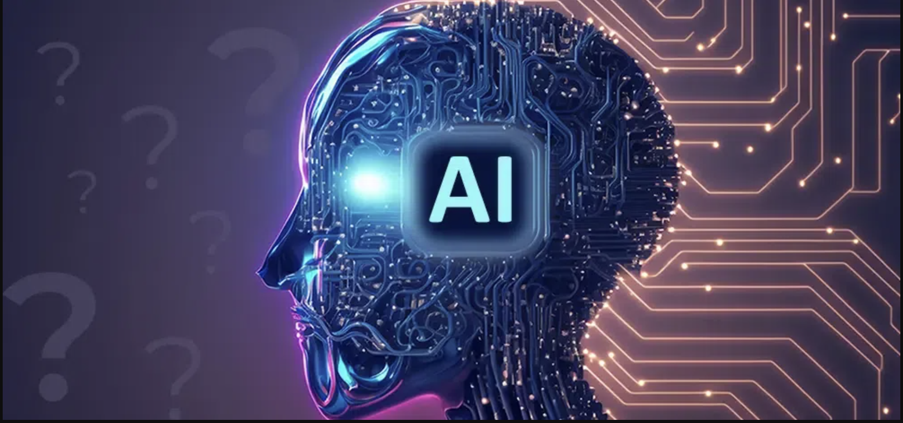

*The following describes my personal experience with using AI specifically for learning in the classroom environment for ICS 314*

<p align="center">

</p>

## **Introduction**

As technology continues to develop overtime, our methods to studying or learning new material should also evolve as well. These methods should reflect such technological advancements, so that we can not only utilize it but also understand its effectiveness in the type of role or impact that it has on our society. In terms of the classroom learning environment specifically, our ability to learn has substantially been enhanced due to the wide range of opportunities that AI (Artificial Intelligence) has presented to us. 

I have only begun to The tools that I mainly used were ChatGPT and GitHub CoPilot. Overall, I found these to be very beneficial in assisting with several coding problems and experience that "light bulb" moment among aspects that I misunderstood or had difficulty comprehending in this class. 

AI is often grouped with other websites that offer personal assistance for homework, such as Chegg, CourseHero,, which gives it a negative reputation for educational purposes. The powerful and dynamic responses that is provided seem legit enough to invoke the "copy-paste" method for students. Though this is a fair statement, it limits the student's ability to learn in through a different number of ways as well. This limitation only promotes a certain way or style of learning, which is not favorable to students who don't thrive or benefit from that style. Learning is more than being in a linear structure. With the usage of ChatGPT,

## **Personal Experience with AI**

### Experience WODs

### In-class Practice WODs

### In-class WODs

When inputting the prompt from the JavaScript 3 WOD, here is what ChatGPT gave as a result:

```javascript
// Assuming you have underscore.js included in your project

// Sample dataset structure (co2)
const co2Data = [
  { year: 2018, ppm: 345 },
  { year: 2019, ppm: 355 },
  { year: 2020, ppm: 360 },
  // Add more data here
];

// Function to check if a specific year's CO2 level is greater than 350 ppm
function unsafe(data, year) {
  const yearData = _.findWhere(data, { year });
  return yearData && yearData.ppm > 350;
}

// Function to count the number of years with CO2 levels greater than 350 ppm
function numUnsafe(data) {
  const unsafeYears = _.filter(data, (item) => item.ppm > 350);
  return unsafeYears.length;
}

// Example usage
const yearToCheck = 2020;
console.log(`Is ${yearToCheck} unsafe? ${unsafe(co2Data, yearToCheck)}`);
console.log(`Number of unsafe years: ${numUnsafe(co2Data)}`);
```

The solutions that were generated in defining the "unsafe" function provided an underscore function that I was not all that familiar up until that point of the WOD. However, it allowed me to use previous underscore functions that I have learned, such as _.pluck, _.filter, and _.sortBy to jump start an idea for my actual solution. 

### Essays

### Final Project

### Learning a Concept / Tutorial

### Answering a question in class or in Discord

### Asking or answering a smart-question

### Coding example 

### Explaining code

### Writing code

### Documenting code

### Quality assurance 


### Other uses in ICS 314 not listed

I haven't really used AI for other areas in this class because I haven't had many opportunities in doing so. 

## **Impact on Learning and Understanding**

Using generative AI tools such as ChatGPT and GitHub CoPilot have allowed me to understand specific details of software engineering concepts. These include learning how to make custom methods in Meteor and utilize components effectively in React for a cleaner UI design. I was also able to further expand my prior knowledge by looking at different ways to implement certain snippets of JavaScript code. The solutions generated by AI would often provide different approaches as to how I would normally solve a problem. Seeing these different methods enabled me to view new perspectives to problem-solving. This  allowed me to deepen my understanding of a certain concept. It is also beneficial for future scenarios when I encounter similar problems because I can refer to approaches and develop new techniques for my problem-solving abilities.

In general, however, this may not always be the case for other users. With any tool, how you use technology ultimately determines its effectiveness. 

Or at the very least, it helped me with extra keywords in searching, which led me to more resources and possibilites that I could Google to ultimately me help find what I was looking for.


One of the main things that I noticed is that ChatGPT is very consistent in asking general questions. These include broad topics of 

## **Practical Applications**
talk about using ChatGPT for HACC project

## **Challenges and Opportunities**


Challenges include server errors and backlogs (outages on the API), unreliable ; partial outages at times
checking for accuracy, relying on it as the truth
simply getting the solution and not understanding why to it

Opportunities: local integration, multiple files

## **Comparative Analysis**
Traditional teaching methods:
-limited topics to scope of class
-not much instant access
-

AI learning:
-confusing
-misinterpreting results
-more personal engagment and experimentation
-can't take answers at face value
-mentally engaging of realizing if the solution is correct
-this is the other aspect of learning, further check your current understanding
-require more "time" depending on the depth of the search.


## **Future Considerations**
should be included and allowed in classes
learning resource, opens opportunity for more students to set-up for success not within the minimal subspace of the course itself but also in truly being able to practice 

- balancing laziness morality w/ curious mindset
- 
## **Conclusion**
how you use it to your advantage, overusing it, will help complement jobs instead of overtake and replace them.
over relying on it, learning becomes more linear and one dimensional, not as impactful as utilizing other tools and resources of education.
