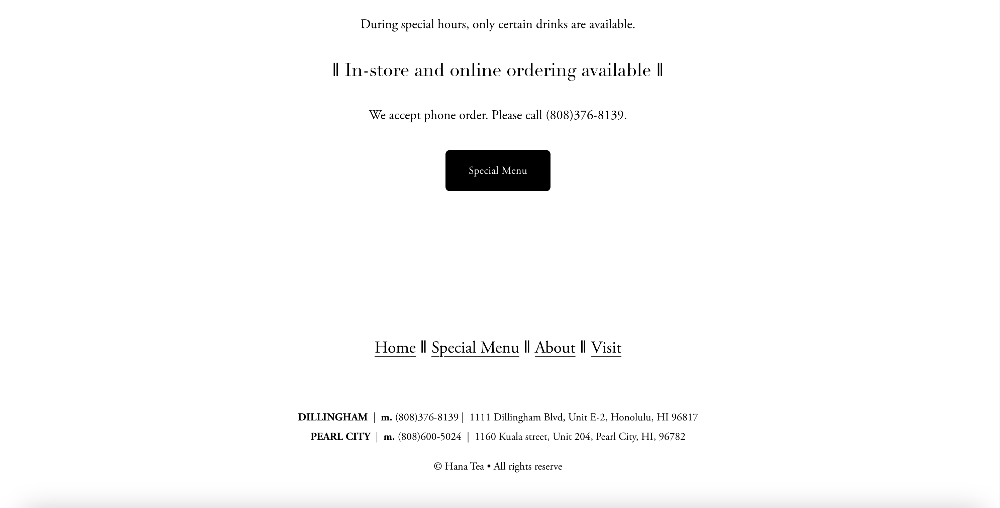
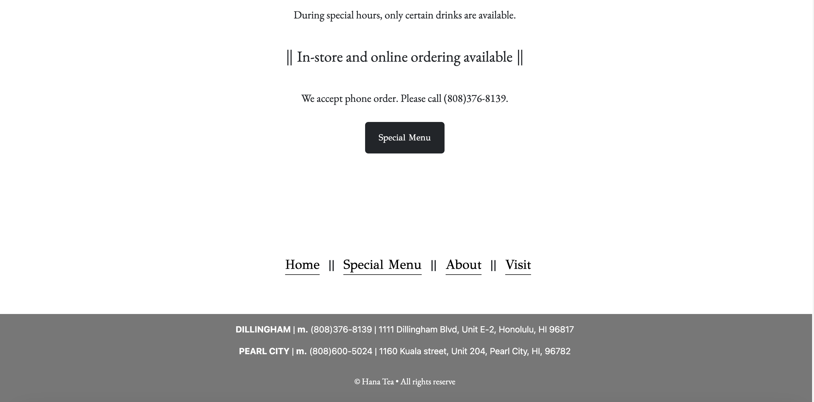
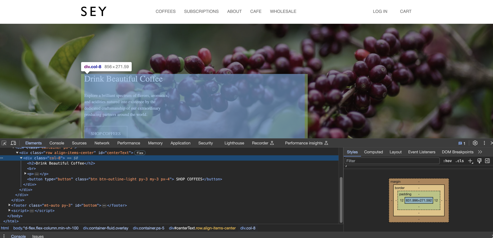
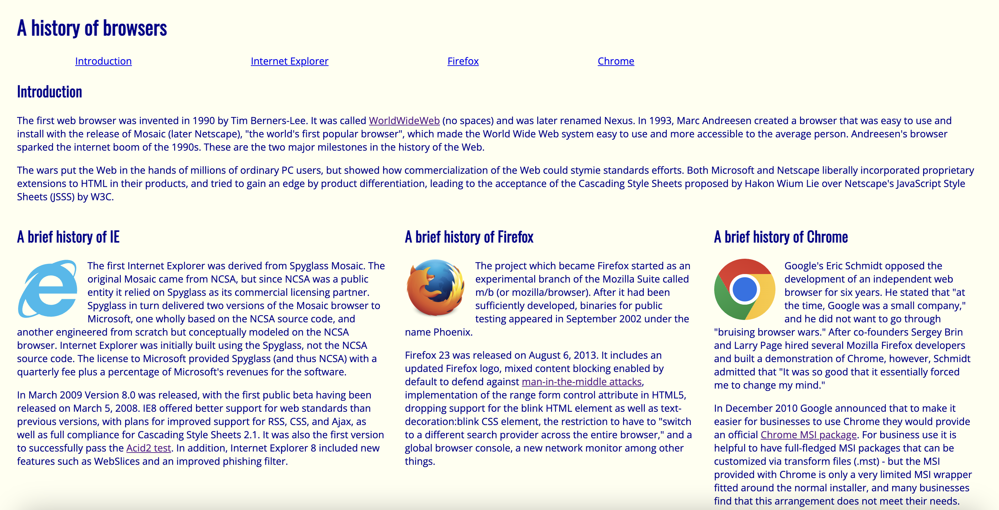
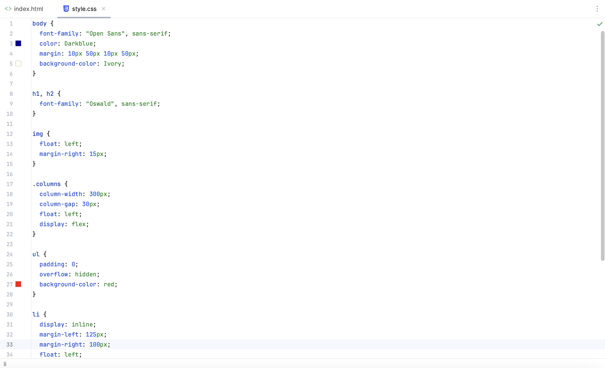
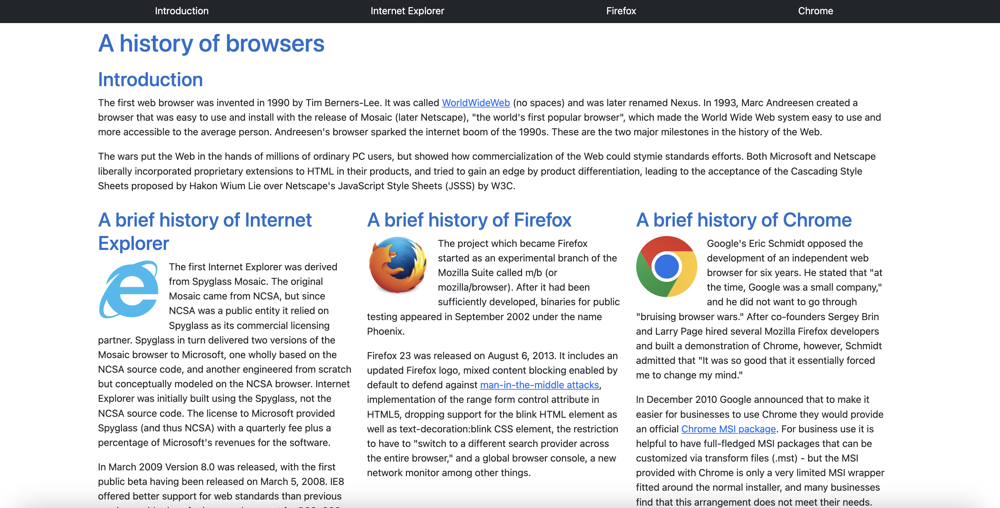
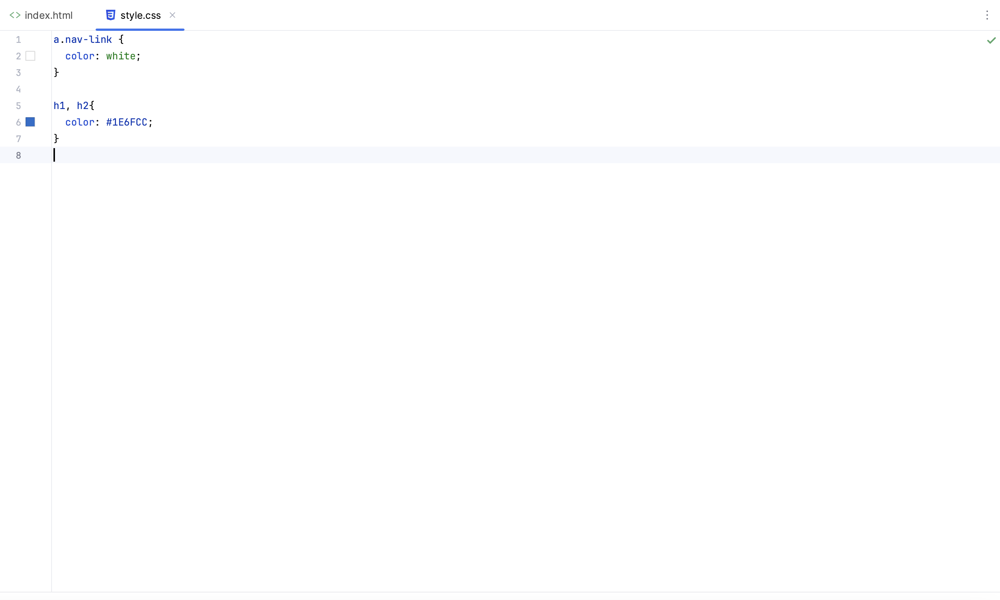

*The following describes my personal experience with using AI specifically for learning in the classroom environment for ICS 314*

<p align="center">

</p>

## **Introduction**

As technology continues to develop overtime, our methods to studying or learning new material should also evolve as well. These methods should reflect such technological advancements, so that we can not only utilize it but also understand its effectiveness in the type of role or impact that it has on our society. In terms of the classroom learning environment specifically, our ability to learn has substantially been enhanced due to the wide range of opportunities that AI (Artificial Intelligence) has presented to us. 

I have only began to The tools that I mainly used were ChatGPT and GitHub CoPilot. Overall, I found these to be very beneficial in assisting with several coding problems and 

AI is often grouped with other , which given it a negative reputation for educational purposes. Though this is a fair statement, it limits the student's ability to learn in through a different number of ways as well. This limitation only promotes a certain way or style of learning, which is not favorable to students who don't thrive or benefit from that style. Learning is more than being in a linear structure. With the usage of ChatGPT,

## **Personal Experience with AI**

### Experience WODs
I have used 
### In-class Practice WODs

### In-class WODs

### Essays

### Final Project

### Learning a Concept / Tutorial

### Answering a question in class or in Discord

### Asking or answering a smart-question

### Coding example 

### Explaining code

### Writing code

### Documenting code

GitHub Copilot

### Quality assurance 


### Other uses in ICS 314 not listed

I haven't really used AI for other 

## **Impact on Learning and Understanding**

Using generative AI tools such as ChatGPT and GitHub CoPilot have allowed me to understand specific details of software engineering concepts. These include learning how to make custom methods in Meteor and utilize components effectively in React for a cleaner UI design. I was also able to further expand my prior knowledge by looking at different ways to implement certain snippets of JavaScript code. The solutions generated by AI would often provide different approaches as to how I would normally solve a problem. Seeing these different methods enabled me to view new perspectives to problem-solving. This  allowed me to deepen  . It is also beneficial for future scenarios when I encounter similar problems because 

In general, however, this may not always be the case for other users. With any tool, how you use technology ultimately determines its effectiveness. 
Or at the very least, it helped me with extra keywords in searching, which led me to more resources and possibilites that I could Google to ultimately me help find what I was looking for.


One of the main things that I noticed is that ChatGPT is very consistent in asking general questions. These include broad topics of 

## **Practical Applications**
talk about using ChatGPT for HACC project

## **Challenges and Opportunities**


Challenges include server erros and backlogs (outages on the API), unreliable ; partial outages at times
checking for accuracy, relying on it as the truth
simply getting the solution and not understanding why to it

Opportunities: local integration, multiple files

## **Comparative Analysis**
Traditional teachning methods:
-limited topics to scope of class
-not much instant access
-

AI learning:
-confusing
-misinterpreting results
-more personal engagment and experimentation
-can't take answers at face value
-mentally engaging of realizing if the solution is correct
-this is the other aspect of learning, further check your current understanding
-require more "time" depending on the depth of the search.


## **Future Considerations**
should be included and allowed in classes
learning resource, opens opportunity for more students to set-up for success not within the minimal subspace of the course itself but also in truly being able to practice 

## **Conclusion**
how you use it to your advantage, overusing it, will help complement jobs instead of overtake and replace them.
over relying on it, learning becomes more linear and one dimensional, not as impactful as utilizing other tools and resources of education.

* <span style='font-family: monospace; color: #E685B5;' target='_blank'>**.navbar**</span> 
* <span style='font-family: monospace; color: #E685B5;' target='_blank'>**.navbar-nav**</span> 
* <span style='font-family: monospace; color: #E685B5;' target='_blank'>**.navbar-expand**</span> 
* <span style='font-family: monospace; color: #E685B5;' target='_blank'>**.navbar-brand**</span> 
* <span style='font-family: monospace; color: #E685B5;' target='_blank'>**.navbar-toggler**</span> 
* <span style='font-family: monospace; color: #E685B5;' target='_blank'>**.navbar-link**</span> 
* <span style='font-family: monospace; color: #E685B5;' target='_blank'>**.navbar-item**</span> 
* <span style='font-family: monospace; color: #E685B5;' target='_blank'>**.navbar-text**</span>  ... and much more.

All of these options made the styling of elements difficult to understand.

In addition to this, I realized that there were generally a lot more nested tags in my html file when working with the Bootstrap classes. The following shows a sample code of what this might look like in designing all elements of a full navigation bar at the top of a webpage.

```javascript
<div class="px-0 justify-content-center pb-2 bg-light">
</div>
```

As you can see, there is a lot to take in. Attempting to comprehend each pairing of these nested tags was an insurmountable headache. It was also complicated to originally figure out which Bootstrap class to use for each html tag and which HTML tag to wrap in for a specific element.

The most troubling issue that I’ve encountered with Bootstrap so far is learning how to adjust the spacing and alignment of elements, containers, and text. I found that there are varying approaches to take when wanting to align a component in a specific way. The wide varying number of options to choose from is what made it difficult in learning how each class is used.

Adding on, the main caveat to all of these choices is that the options you choose are dependent on the entity that needs to be aligned, as well as the size of the space that you are working with. There were times when using the align-items-center class did not vertically center the elements that I wanted mainly because the space of the row or container was not set to my desired height. I also thought that the difference between **align-items** and **justify-content** were troubling to distinguish between horizontal and vertical alignment. Using mx-auto and my-auto to center different forms of content, like images and text, didn’t seem to help with centering as well. Even though this was the case, however, I further realized that these classes only apply to the container’s position relative to the web page- not to the content within the container itself. In order to center the content, I would have to use other text alignment classes, like text-center. Furthermore, learning about flex-box utilities such as **d-flex** and **flex-column** added on to the mounting heap of aspects that I didn’t understand when it came down to fixing the positioning of such elements.

## **Reaching a Turning Point**
Although it seems like I’ve only had troubling issues and setbacks with Bootstrap, there are some positive takeaways that I can see today.

### Responsiveness
One of the main things that I first noticed is that elements would seamlessly adjust with the same relative scaling and positioning of the size of the screen. An example of this aspect can involve menu tabs in a navigation bar that merge into a dropdown menu when the size of the screen is shrinked or below a certain threshold of pixel width. I found this to be really neat and beneficial with web design because the main “theme” of the design can be reused across several platforms. The feature is very simple implementation-wise because unlike raw HTML and CSS, we don't need any additional code to consider the possible conditions of screen size. Thus, the responsive component that is functionally embedded within web UI frameworks like Bootstrap allowed me to appreciate the software more.

### The Upside of the Learning Curve
As I started to get more familiar with Bootstrap, I realized that it is helpful in learning the basic foundation of how a designed layout works. One of the layouts that I found to be valuable is the <a href="https://getbootstrap.com/docs/5.3/layout/grid/" target="_blank">**grid system**</a> implementation. Learning about the grid structure allowed me to visualize different rows of elements because I was able to know the size of the containers. Resizing the height of these rows accordingly enabled me to fix other issues relating to text alignment on a web page. Within each row div, I was able to understand how the length and width of a certain number of columns can affect the spacing of any element. The grid layout also helped me to think more about designing content evenly through separate divisions (divs), so that elements can be more visually appealing and cohesive with one another.

There are also many new elements that I have been able to style more simply with Bootstrap, as opposed to only CSS. Some of the components that I found to be useful include the buttons, navigation bar tabs, dropdown menus, and icons. The defaults for each of these components also come with different sets of customization options, such as changing colors or element sizes, which makes the intended effect much  easier to implement. The overall look and feel of the website can also match the designed layouts found on professional websites. As an example, here is an attempt to recreate <a href="https://www.hanatea808.com/" target="_blank">**Hana Tea's**</a> website. The first set of images show the original, while the second set show my recreation with Bootstrap.

<div class="text-center" pe-4>
    <strong>ORIGINAL:</strong>  
</div> 

<div class="text-center p-4">
  <a href="https://raw.githubusercontent.com/jpinera/hanatea-recreation/main/HanaTea-Website-Real-pt1.png" target="_blank"></a>
  <a href="https://raw.githubusercontent.com/jpinera/hanatea-recreation/main/HanaTea-Website-Real-pt3.png" target="_blank"></a>
</div>

<br/><br/>

<div class="text-center" pe-4>
    <strong>RECREATION:</strong>  
</div> 

<div class="text-center p-4">
  <a href="https://raw.githubusercontent.com/jpinera/hanatea-recreation/main/Recreation-pt1.png" target="_blank"></a>
  <a href="https://raw.githubusercontent.com/jpinera/hanatea-recreation/main/Recreation-pt3.png" target="_blank"></a>
</div>

Aside from the slight differences in font and spacing, the web pages look pretty similar. In general, by using Bootstrap, I would say that you can get an almost identical layout design that is found on other clean-looking websites. Thus, the initial investment has resulted in positive long term results for learning more about formatting components and web development.

Source code / Link to repository on GitHub: <a href="https://github.com/jpinera/hanatea-recreation" target="_blank">**Hana Tea Website Recreation with Bootstrap 5**</a>


### Upon further Inspection, Inspection, Inspection…

In addition to the grid system on Bootstrap, inspecting the elements via Chrome Developer Tools assisted in my comprehension for how containers worked. Viewing the Styles and Computed sections of the elements specifically allowed me to see the font families and font sizes used for a particular website. With Chrome Developer Tools, I was able to look at the margin and padding surrounding the content in each element. This enabled me to make quick adjustments when necessary. It also made me better grasp the concept of having every single component placed in its own box or container. As a result, element inspection facilitated my “debugging” process in terms of fixing the spacing between such elements. I could break down each individual aspect of a nested tag to fix the spacing accordingly, which allowed me to understand which Bootstrap classes to use for a specific HTML tag. I was also able to learn other techniques of formatting, such as overlapping images with text or creating a “tinted” background image via an overlayed mask of black transparent color.

<p align="center">
    <a href="https://raw.githubusercontent.com/jpinera/jpinera.github.io/main/img/technical-essays/buckle-up-to-level-up/Inspect-elements.png" target="_blank">
        
    </a>
</p>

<br>

## **Comparing Bootstrap vs Raw HTML & CSS**


I would definitely prefer to use Bootstrap over raw HTML and CSS styling because adjusting and customizing such styles is much easier to implement. Other reasons for my preference are indicated and mentioned above. The following images show a set example of producing similar web pages with just raw CSS and with Bootstrap.  

<div class="text-center" pe-4>
    <strong>Raw HTML & CSS:</strong>  
</div> 

<div class="text-center p-4">
  <a href="https://raw.githubusercontent.com/jpinera/jpinera.github.io/main/img/technical-essays/buckle-up-to-level-up/browser-normal.png" target="_blank"></a>
  <a href="https://raw.githubusercontent.com/jpinera/jpinera.github.io/main/img/technical-essays/buckle-up-to-level-up/css-normal.png" target="_blank"></a>
</div>

<br/><br/>

A much more complicated stylesheet is needed to produce the same design when using raw HTML and CSS compared to Bootstrap. This is because the style aspects of Bootstrap are initiated in the classes of the divs of the HTML file.

<br/><br/>

<div class="text-center" pe-4>
    <strong>Bootstrap 5 Implementation:</strong>  
</div> 

<div class="text-center p-4">
  <a href="https://raw.githubusercontent.com/jpinera/jpinera.github.io/main/img/technical-essays/buckle-up-to-level-up/browser-bootstrap.png" target="_blank"></a>
  <a href="https://raw.githubusercontent.com/jpinera/jpinera.github.io/main/img/technical-essays/buckle-up-to-level-up/css-bootstrap.png" target="_blank"></a>
</div>

## **On to the next step in the level?**

I don’t feel as comfortable as I would like with Bootstrap to advance to the next step of implementing a fully functional website.  With this being said, I still look forward to learning about other aspects of front-end development. This includes working with open-source JavaScript libraries, such as <a href="https://react.dev/" target="_blank">**React**</a>, which allows the components of the website to be more interactive. Using active links, buttons, and input forms to redirect to other sites and collect certain user information is something that can continue to enhance my skill set of tools in my software engineering journey. It would definitely be engaging and interesting to see how these both Bootstrap 5 and React work hand-in-hand to produce a cohesive webpage overall.

<p align="center">
  
&nbsp;       
&nbsp;
&nbsp;

</p>

Understanding the components to UI design and learning how to perform it well is an important skill mainly because UI associates with the concept of User-Experience (UX). The main difference is that UI focuses on design, while UX focuses more on the overarching product via functional components. However, both aspects are needed to create a fully-operative website that is compelling, cohesive and effective in fulfilling a user’s needs or solving a problem. This is ultimately the next step towards covering the main basics of front-end web development.


## **Still a Long Way to Go**


As with anything, a lot of practice is needed to 1) develop more familiarity and 2) refine your expertise in a specific area. While there is still much more that I can learn in designing elements on webpages with a framework like Bootstrap 5, I feel like utilizing it is a step in the right direction to designs that are of high-quality. Perhaps using UI frameworks can not only improve designs, but can also enhance work flows for front-end development. This is beneficial in software engineering as a whole because teams can work more efficiently in the design process for projects. Similar to coding standards, UI frameworks provide consistent results, which allows teams to work effectively and in unity. The final version of the product or project will therefore look more polished and refined just from this consistency. However, this is merely my opinion from my experience…So what do you say? **_Buckle up to level up with Bootstrap 5!_**

