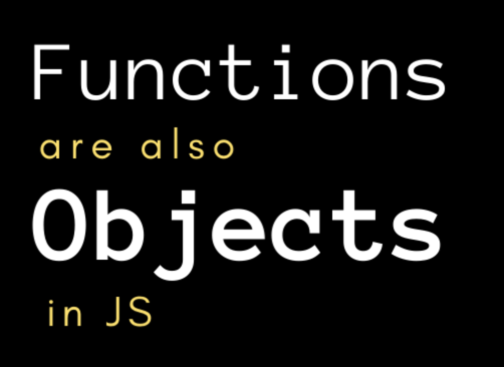
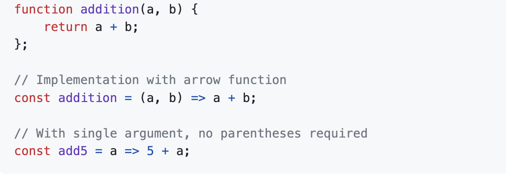

*My personal experience of learning software engineering fundamentals through ICS 314*

## Compiling & Developing the Toolkit
There is a common saying that all great things come from small beginnings.  This is something that I have always considered and believed in. It is true that not everyone becomes an expert overnight, and while pure talent may beat out hard work, it is eventually the slow growth of knowledge and skills that shapes an expert into a master of their own craft overtime. The repetitive cycle of practicing, failing, learning, and redoing ultimately help us to advance in our “expertise status” through small baby steps, one step at a time. It is these combinations of elements that help us to define and refine our skills in our set of tools. Like an artist eagerly painting their canvas or a farmer fervently planting their crops, the right tools need to be utilized correctly and consistently resharpened to perform their desires, in which eventually, their progress will reveal their masterpiece and reap their harvest. In other words, though developing a true skill takes time, everyone has their own starting point and must start from somewhere….

Which is why at the start of this Fall 2023 semester, I wasn’t really sure what software engineering was. I also didn’t really know what to expect, as I haven’t really been able to work on meaningful software-related projects that can enhance or showcase my skills. And so… ICS 314 was that first stepping stone in both my academic and software engineering journey. Though I’m not certain of what the future promises, I can firmly say that it is a step in the right direction of my goal to work in software development.

During my experience in ICS 314, I have learned many new practices to help improve my abilities in web development. This not only includes the technical skills, but also the soft skills that can really play a part in team settings and work environments for positions in the computer science field. One of my biggest takeaways from this class is that the ability to work with a group on a common goal or project is a highly-valued skill, as you can better understand fundamental software principles from the help of peers and practice applying your knowledge into something tangible (aka. learning by doing!). Learning about software engineering conventions for the first time was a steep but necessary learning curve in forming basic technical capabilities. In general, however, I feel like I have gained a stronger understanding of some of the core concepts that software engineering entails. These include the following main areas:

## **Configuration Management**
In the realm of software development, configuration management (CM) is a process that consistently manages the states and progress of projects. Having a good system to keep track of a project or product’s performance can definitely help maintain the organization and quality of the development process as a whole. Managing the layout or design of a system is also important in the aspect of trial testing and deploying the product. It helps make the design and organization process more effective because having effective CM can allow possible errors to easily be identified along the way. This speeds up the operations of planning and finding alternate solutions to these found problems. The approach to configuration management attempts to solve 3 conceptual problems that often occur when working on software projects:
Double maintenance problem: This occurs when different copies of the same file need to be separately updated, which wastes both time and effort. CM prevents this from happening by allowing updates to all respective versions/copies of a file.
Shared data problem: This occurs when only one person can access a file at a time. CM allows for multiple users to have access for better collaboration.
Simultaneous update problem: This occurs when multiple people update a file at the same time, in which only one of the person’s changes gets taken into effect. CM tries to prevent this “clobbering,” so that updates from both parties are considered accordingly.

In addition, CM also relates to version control and defect tracking systems. Version control, which is the idea of keeping multiple versions of a certain software system, is necessary for revising and updating certain components of a project. Defect tracking systems help monitor the progressional status in the process, checking for any unwanted errors or changes to a specific version of a project. This is also a key component to CM because there is a cause-and-effect relationship between changes made to a system. Hence, the results of these changes might cause other unintended problems to occur, which then require more revisions in configuration.

I was able to practice configuration management through a distributed CM workflow. This system works on the basis of copying and exchanging a person’s version of a project. Users make copies of another person’s version of a project to make their own personal updates. They can then send those changes back to the original person. The overall model consists of a “push-and-pull” technique, where developers pull or fetch changes made by other developers and push their changes to a main repository for other developers to possibly fetch from. This is usually done from a centralized master “branch,” which can represent the final polished version of a project.

In my ICS 314 class, this was done through Git (version control management system) and GitHub. I found the idea of holding all aspects of a project in a GitHub repository to be very effective for organizing all of its contents. More importantly, the practice of using branches on GitHub was a very interesting approach. Having different branches allowed me to easily compare the different versions of a project, which facilitated the process of making decisions for a specific design or functional component. Cloning and updating changes via pulling and pushing to the main branch also made it efficient in collaborating with other peers, since incremental consistent updates can slowly build the ultimate vision of the desired outcome.

One of the main things that helped me understand configuration management was the merging conflicts that occurred on GitHub. These merging conflicts usually occurred when multiple users edited the same line of the file while pushing their changes. Although it was very frustrating to have these conflicts at first, I was able to get more comfortable in fixing these issues. Due to the easy interface from GitHub Desktop, merge conflicts enabled me to recognize other possible implementation and design solutions that other peers had thought of. Therefore, I can see myself utilizing configuration management and using GitHub as a platform for future projects because it organizes the version history to maintain all of one’s progress. In the context of efficiency, being able to work on changes independently and locally are significant in making meaningful impact and advancements in the development process.

## **User Interface Frameworks**
In terms of web development, I have been able to improve my technical abilities in design through the concept of web frameworks. User-Interface (UI) frameworks are pre-built components or libraries that can help one design elements in a more aesthetic and efficient manner. Utilizing UI frameworks in product or project designs can overall make the display feel more professional and of higher quality. In addition to an attractive format, UI frameworks also simplify the development of coding the layout due to the approach of recycled material. UI frameworks allow developers to easily reuse components for creating interfaces. Since these elements are often intended to be implemented in a ready-to-use format, the default designs often contain a structure that is simple and neat. It also enables developers the freedom and flexibility to customize the basic makeup of a component to their intended theme, style or look. Furthermore, the benefit of UI frameworks also come with the purpose of creating a uniform theme and look throughout the project as a whole. This not only allows the project to feel cohesive in the layout throughout an application, but it also enables consistent results when being viewed across multiple browsers and varying media platforms or devices.

Throughout the semester, I have been able to work with UI frameworks, such as Bootstrap 5 and React, to efficiently design interfaces for web applications. I found Bootstrap and React to be very favorable frameworks due to the simplicity of their responsive designs. Simply put, I liked how these frameworks were mobile-first, which is the notion of automatically formatting designed elements to specific screen sizes without having to make any customizations. Due to React and Bootstrap’s mobile-first functionality, I could purely focus on the overall look of the layout of a web page without really having to consider how it would look differently on a tablet or phone.  Adding on to this, I found the (words)
The following images show some examples of web pages that I helped to design using React and Bootstrap 5:

## Looking Towards the Future

In general, learning these foundational software engineering principles has allowed me to get a better perspective. Potential in job market and practices, ever growing field of computer science and software development. Looking to develop/refine more skills and move forward to ics 414these In the end, only time will tell.

If you wanted to learn how to swim for the first time, how would you go about doing so? If you had to choose between learning from a swim instructor or learning by jumping right into the water, which one would you pick? One has a certain structure to help you build up the basics, while the other lets you figure out the basics randomly through experience. In the second option, you ultimately get to decide what basics you want to stick to, or rather, the dynamic fluidity of the “rules” you conform can influence your skill level as a swimmer. If you chose the latter and have had coding experience before, then JavaScript (JS) might be the coding language for you. For beginners that have a passion for programming with little to no programming experience, JS may or may not be the best option, depending on your viewpoint. Personally, I view JS as Java’s better older brother because just like an older brother, JS just seems to make everything look easy, or if anything, _easier_. Although I just started learning how to code in JS, I am enjoying my journey with it so far, possibly making it my new favorite language. 

Before the semester even started, all I knew about JS was that it was used for web development. I was nervous about learning the new syntax and rules at first, only to later find that there aren’t many rules at all. As a whole, I find its lack of limitations to be very liberating and user-friendly compared to other languages such as Java, C, or even Python.

## Functions are priority: They are _first class_

After exploring a little bit in JS, I realized that a majority of its dynamic flexibility revolves around its implementation with functions. In JS, functions are first-class. This means that functions are treated just like any other object or variable. You can assign a variable to a function, or even a function to another function. Functions can be parameters for a function or act as return values within another function. The collection of these functions can therefore produce hierarchical data structures that are very organic or fluid in nature. Unlike other languages, such as Java, JS allows functions to be generated dynamically at run-time, which can prevent the occurrence of spending a significant amount of time time looking for such tedious bugs in larger-scale projects. The possibilities when working with functions are quite literally… endless. 

## Syntax and Technicalities Seem Innovative

Some interesting aspects that I found to be effective are some of the syntax and keywords integrated in JS. These components allowed me to write simpler lines of code and made small programming assignments effortless. Staying on the topic of functions, I learned about the short-hand notation syntax for writing functions. From ES6, using the arrow markers (**=>**) can be used to connect the function header with the function’s body of code in a much simpler manner. This was beneficial, especially for functions that were more straightforward, since a function can be defined by just one line of code, as seen in the example below. In comparison to writing functions in Java, which involves writing a function header and body via multiple lines of code, I found the shortcut to be quite refreshing at first glance. 

In addition to simple syntax, I was intrigued by the keywords and technicalities in JS. An example of this was the **let** keyword. This is similar to declaring any type of variable in Java in that the variable is scope-based and unique to the name that it’s given. However, the main difference that I found is that there is flexibility in changing or converting data types of a variable. Unlike Java, you don’t have to declare a variable’s specific data type, thus making reassignment of variables in JS much more convenient. This applies to other instances as well, such as objects and data structures, where a single array can contain a combination of integers, strings, other arrays, or any other type. 

Due to the flexibility of automatic data type conversion in JS, chunks of code can be free from errors during compile time. While experimenting with the language, I found that a practical benefit of this case is from the comparison of two types in conditional statements. The comparison operator "**==**” in JS can allow two different data types to be checked. For instance, the **string** **"8"** and the **integer** **8** will result in true when its corresponding comparison "**==**” is used. In contrast to Java, using "**==**” requires the same data type to be compared, which is similar to the strictly equal comparison operator "**===**” for JS. 

## Standardized ES6 with JavaScript: More Shortcuts

There were a couple of ES6 syntax shortcuts that I thought were noteworthy. The first included the **for…of** syntax used in iteration loops, which iterates over repeatable objects. The syntax was a bit tricky at first, but I later found it to be a helpful shortcut in accessing the elements of any object, like arrays. Furthermore, the spreads operator (**...**) was another shortcut that I found to be insightful because accessing an element from an object, or expanding upon a previously established one, seemed much more effortless. In general, I’m still uncomfortable with utilizing the ES6 syntax, but I hope to get more use out of it as I continue to work with JS overtime.

## Possible Drawbacks?

As with everything in life, there are some disadvantages that can act as stumbling blocks when working with JS. As a novice programmer who is trying to re-sharpen their coding skills through this course, some of the advantages in JS did lead to confusion and misunderstanding. There were several times where I struggled understanding the syntaxial shortcuts dealing with functions and for loops, which caused lots of issues with debugging. Since I was already used to coding in Java previously, adjusting my mindset to not having to worry about data types for variables was also quite a challenge, making it time-consuming to just understand small snippets of sample code. With enough practice and familiarity, however, I believe that some of these disadvantages are inconsequential towards the positive upside of JavaScript’s features in the long run. 

## Approaching Software Engineering "Athletically"

Developing your software engineering from an “athletic” perspective involves the consistency of attempting practice activities called “workouts-of-the-day,” or WODs. I find this strategy to be both challenging, yet rewarding in a couple of ways. One of the main benefits that I get from practicing WODs includes the “hands-on” technique of solving coding problems. By doing so, I’m not only able to critically think about solving the problem itself, but I’m also becoming more familiar with JS and its syntax.

Similar to any workout, intensity and duration play important factors towards positive progress and reliable outcomes. The intensity of a practice WOD produces my motivation to focus, think quickly, and complete it successfully. I find the time pressure of completing the WOD to be beneficial as well. I think that the stress created from the time limit allows me to use my resources effectively and helps me to get a better sense of time management when working through the problem. 

Adding on to this, the aspect of reiteration from the practice WOD forces to me learn in an effective way. From this, I’m able to produce two main benefits. The first is to experiment with different methods in solving the problem. Attempting the problem multiple times allows me to find other solutions that could possibly be more efficient and save time coding. Improving this aspect will enhance my coding and logic comprehension. Instead of memorizing the same solution via “muscle memory,” I can be more comfortable with the parameters surrounding a specific type of problem and become more aware of its corresponding “simpler” solutions, so that I can save time coding on the actual WOD. The second luxury of constant repetition relies on the habitual nature to practice a WOD everyday, which I believe is a good habit to create and maintain throughout my potential career in tech. Hence, the approach to train in this format contains adequate and essential foundations of consistency and sustainability.

## Overall Thoughts

To sum it up, using JavaScript (JS) as another tool in your software engineering arsenal can be beneficial. Factors that play into maximizing the dynamic benefits of JS and effectively putting it into use will depend on one’s own motivational intentions and habitual practices for it. Though my feelings toward JS might change later on in my software development journey, I seem to be enjoying it as of right now. In consideration with one’s own coding skills and experience, as well as the type of project that one is pursuing, I would say that JavaScript is overall a user-friendly language for web development. However, it is not for everyone. So why not “dive in the waters” and give it a try? 

