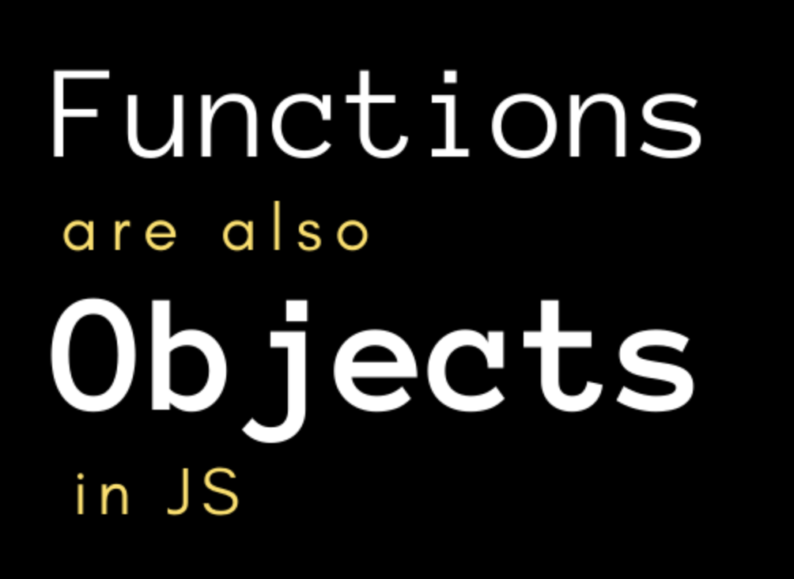
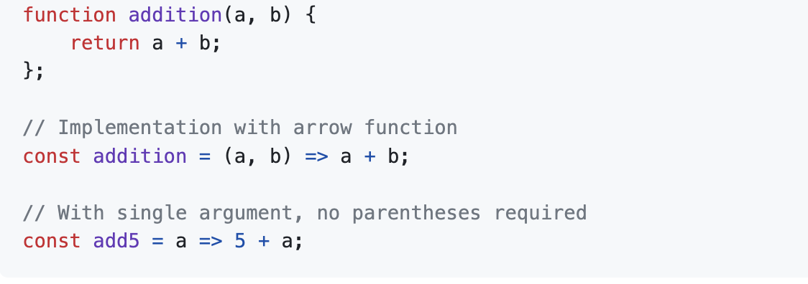

*My personal experience with learning JavaScript basics (Module 1) and the "Athletic" Software Engineering Model*

If you wanted to learn how to swim for the first time, how would you go about doing so? If you had to choose between learning from a swim instructor or learning by jumping right into the water, which one would you pick? One has a certain structure to help you build up the basics, while the other lets you figure out the basics randomly through experience. In the second option, you ultimately get to decide what basics you want to stick to, or rather, the dynamic fluidity of the “rules” you conform can influence your skill level as a swimmer. If you chose the latter and have had coding experience before, then JavaScript (JS) might be the coding language for you. For beginners that have a passion for programming with little to no programming experience, JS may or may not be the best option, depending on your viewpoint. Personally, I view JS as Java’s better older brother because just like an older brother, JS just seems to make everything look easy, or rather easier. Although I just started learning how to code in JS, I am enjoying my journey with it so far, possibly making it my new favorite language. 

Before the semester even started, all I knew about JS was that it was used for web development. I was nervous about learning the new syntax and rules at first, only to later find that there aren’t many rules at all. As a whole, I find its lack of limitations to be very liberating compared to other languages such as Java, C, or even Python.

## Functions are priority: They are _first class_

After exploring a little bit in JS, I realized that a majority of its dynamic flexibility revolves around its implementation with functions. In JS, functions are first-class. This means that functions are treated just like any other object or variable. You can assign a variable to a function or even a function to another function. Functions can be parameters for a function or be returned as a value of a function within another function. The collection of these functions can therefore produce hierarchical data structures that are very organic in nature and fluid in its processing at run time. Unlike other languages, such as Java, JS allows functions to be generated dynamically at run-time, which can prevent the occurrence of spending a significant time looking for such tedious bugs in larger-scale projects.The possibilities when working with functions are quite literally… endless. 

## Syntax and Technicalities Seem Innovative

An interesting aspect that I found to be effective is some of the syntax and keywords integrated in JS. These components allowed me to write simpler lines of code and made small programming assignments to be much easier for me. Staying with the topic of functions, I learned about the short-hand notation syntax for writing functions. From ES6, using the arrow markers (=>) can be used to connect the function header with the function’s body of code in a much simpler manner. This was beneficial, especially for functions that were more straightforward, since a function can be defined by just one line of code, as seen in the example below. In comparison to writing functions in Java, which involves writing a function header and body via multiple lines of code, I found the shortcut to be quite refreshing at first glance. 

In addition to simple syntax, I was intrigued by the keywords and technicalities in JS. An example of this was the **let** keyword. This is similar to declaring any type of variable in Java in that the variable is scope-based and unique to the name that it’s given. However, the main difference that I found is that there is flexibility in changing or converting data types of a variable. Unlike Java, you don’t have to declare a variable’s specific data type, thus making reassignment of variables in JS much more convenient. This applies to other instances as well, such as objects and data structures, where a single array can contain a combination of integers, strings, other arrays, or any other type. 

Due to the flexibility of automatic data type conversion in JS, chunks of code can be free from errors during compile time. While experimenting with the language, I found that a practical benefit of this case is from the comparison of data types for conditional statements. The comparison operator "==” in JS can allow two different data types to be checked. For instance, the string "8" and the **integer** 8 will result in true when its corresponding comparison "==” is used. In contrast to Java, using "==” requires the same data type to be compared, which is similar to the strictly equal comparison operator "===” for JS. 

## Standardized ES6 with JavaScript: More Shortcuts

There were a couple of ES6 syntax shortcuts that I thought were noteworthy. The first included the for…of syntax used in  iteration loops, which iterates over repeatable objects. The syntax was a bit tricky at first, but I later found it to be a helpful shortcut in accessing the elements of any object, like arrays. Furthermore, the spreads operator (...) was another shortcut that I found to be insightful because accessing an element from an object, or expanding upon a previously established one, seems much more effortless. In general, I’m still getting familiar with some of the ES6 syntax, but I hope to get more use out of it as I continue to expand and experiment with JS.

## Possible Drawbacks?

As with everything in life, there are some disadvantages that can act as stumbling blocks when working with JS. As a novice programmer who is trying to sharpen their coding skills through this course, some of the advantages in JS did lead to confusion and misunderstanding. There were several times where I struggled understanding the syntaxial shortcuts dealing with functions and for loops, which caused lots of issues with debugging. Since I was already used to coding in Java previously, adjusting my mindset to not having to worry about data types for variables was also a starting challenge, making it time-consuming to just understand small snippets of sample code. With enough practice and familiarity, however, I believe that some of these disadvantages are inconsequential towards the positive upside of JavaScript’s features in the long run. 

## Approaching Software Engineering "Athletically"

Developing your software engineering from an “athletic” perspective involves the consistency of attempting practice activities called “workout-of-the-day” or WODs. I find this strategy to be both challenging, yet rewarding in a couple of ways. One of the main benefits that I get from practicing WODs includes the “hands-on” technique of solving coding problems. By doing so, I’m not only able to critically think about solving the problem itself, but I’m also becoming more familiar with JS and its syntax.

Similar to any workout, intensity and duration play important factors towards the impact on positive progress and reliable outcomes. The intensity of a practice WOD produces motivation to focus, think quickly, and complete it successfully. I find the time pressure of completing the WOD to be beneficial as well. I think that the stress produced from the time limit allows me to use my resources effectively and helps me get a better sense of time management when working through the problem. 

Adding on to this, the aspect of reiteration from the practice WOD forces to me study, learn and practice in an effective way. From this, I’m able to produce two main benefits. The first is to experiment with different methods in solving the problem. Attempting the problem multiple times, allows me to find other solutions that could possibly be more efficient and save time coding. Improving this aspect will enhance my coding and logic comprehension. Instead of memorizing the same solution via “muscle memory,” I can be more familiar with the parameters surrounding the problem and be more aware of the “simpler” solutions, so that I can save time coding on the actual WOD. The second luxury of constant repetition relies on the habitual nature to practice a WOD everyday, which I believe is a good habit to create and maintain throughout my potential career in tech. Hence, the approach to train in this format, via practice WODs, contains adequate and moderate foundations of consistency and sustainability.

## Overall Thoughts

To sum it up, using JavaScript (JS) as another tool in your software engineering arsenal can be beneficial. Factors that play into maximizing the dynamic benefits of JS and effectively putting it into use will depend on one’s own motivational intentions and habitual practices for it. Though my feelings toward JS might change later on in my software development journey, I seem to be enjoying it as of right now. In consideration with one’s own coding skills and experience, as well as the type of project that one is pursuing, I would say that JavaScript is, in general, an overarching user-friendly language to use for web development. However, it is not for everyone. So why not “dive in the waters” and give it a try? 

