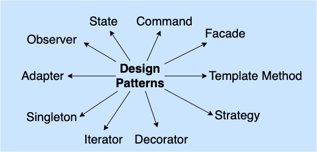
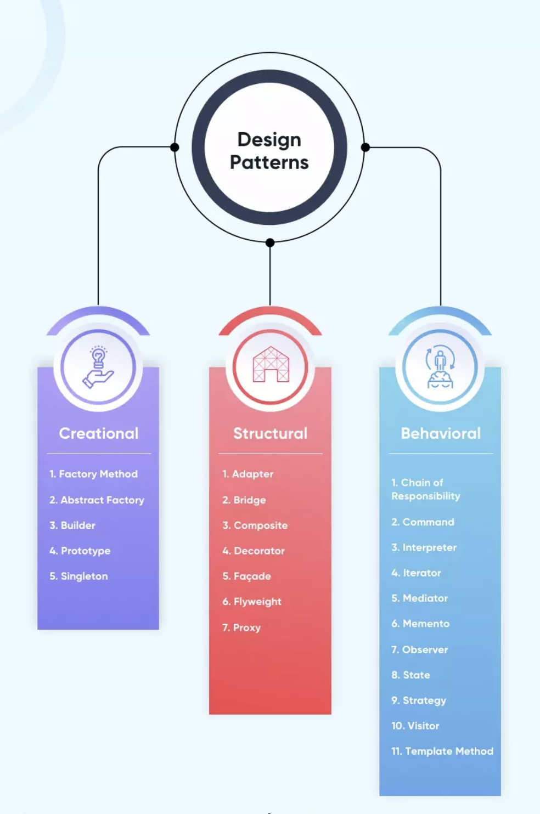
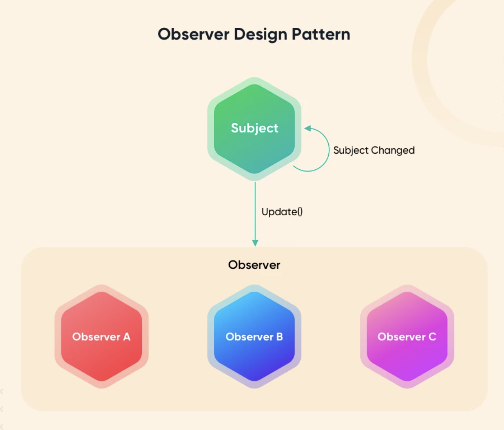

## From Ideas on a Paper

If you wanted to create something from scratch, what steps would you take to ultimately reach that goal? Would you try to plan everything out before starting, or would you want to jump in with experimentation and adjust accordingly to obstacles that occur during the process? While the latter is more straightforward, the former is an approach that can require much more brainstorming and thought-provoking ideas, but can be more efficient, effective, and rewarding in the long run. In the process of constructing/creating any type of building, model, application, or tangible entity, one must have a solid plan in the way for doing so or going about things. The effectiveness of a plan determines how well the basic skeletal structure of such an entity is going to be built and developed upon, which can ultimately play a factor in how successful the final product becomes. As a result, the transition of turning an idea into something tangible not only requires consistent adjusting, but more importantly involves some planning to structure models and methods in an organized and effective way.

  
  

Much like a constructor’s blueprint for a building, or an inspiration from an artists, effective software Design patterns
(Explain analogy and importance of design patterns in software engineering)

## Basics of Design Patterns

(talk about what design patterns are and what are the different types)

## Putting Designs to Practice
(talk about how design patterns were used in code)

 

## Viewing the Outlined Canvas
(conclusion)

 

