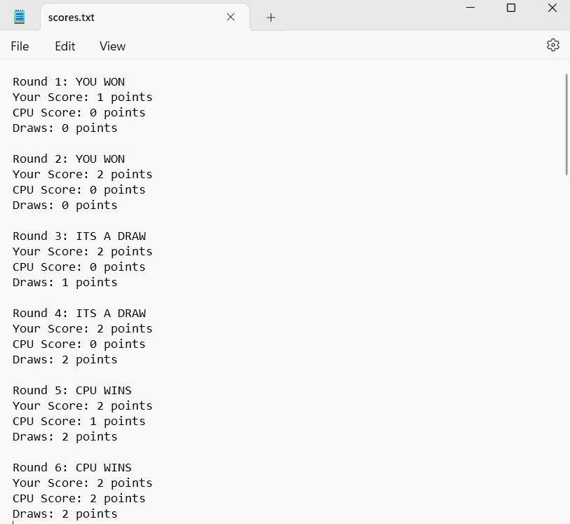

One of the projects that I created for my ICS 211 class was a graphical user interface (GUI) for a Rock-Paper-Scissors (RPS) game. It was designed to help us get practice with event-driven programming through the implementation of an interface in Java called _ActionListeners_. These actions included the initialization of buttons, pop-up text, score counting, and panels for the user to interact with. Image icons and other components of the interface were also utilized for aesthic displays. In the classic game of rock-paper-scissors, players go against the computer, choosing one option of _rock_, _paper_, or _scissors_. The results are then recorded and written to a .txt extension file.

## Project Details

I was responsible for designing and implementing the GUI in this project. This consisted of creating a sketch of the envisioned interface, deciding the size restrictions of the elements and overall window panel, choosing a fitting color scheme for the buttons, and checking the win conditions of the game. 

Upon entering the game, the left panel contains a choice of 3 buttons of where the user can either learn how to play the game, play the game (after playing at least one time), or quit the game. A bottom-middle panel of options is displayed for the user to pick their choice of rock, paper, or scissors. The bottom left panel contains a score counter for the number of times that a user has won, lost, or tied the game. 

Once the user has chosen an option, the computer will randomly make a choice and a text bubble will display the result of the game. In addition, the score counter will update based on the results. The user can then hit **Play Again** to play more games. The picture below shows an example of the user playing through the game and the implemented GUI.


One of the main concepts behind action-driven programming is resetting the method conditions when a user clicks a certain button. Some sample code below illustrates the performed actions that need to be reset in the Java.awt.event library when the user hits **Play Again**. These include the background colors, choice buttons, images, and borders:

```cpp
            // - User hits "Play Again" button
            else if (event.getSource() == bPA) {
               // Clear JLabels and reset results/instructions
               choice.setIcon(null);
               generate.setIcon(null);
               gameResult.setText(" ");
               gameResult.setVisible(false);
               instruct.setText("  Choose one (ROCK, PAPER, SCISSORS) to play  ");
               
               // Enable and disable Jbuttons
               // Reset Jbuttons to orginial format, since user wants to play another game
               bRock.setEnabled(true);
               bPaper.setEnabled(true);
               bScissors.setEnabled(true);
               bRock.setBackground(cRed);
               bPaper.setBackground(cYellow);
               bScissors.setBackground(cCyan);
               bRock.setBorder(BorderFactory.createLineBorder(Color.white, 5, true));
               bPaper.setBorder(BorderFactory.createLineBorder(Color.white, 5, true));
               bScissors.setBorder(BorderFactory.createLineBorder(Color.white, 5, true));
               bPA.setEnabled(false);
            }
```
When the user decides to stop playing and quits by hitting the **Quit** button, a display message will indicate that the window will automatically close. Furthermore, a _scores.txt_ file is created in the same directory as the ran program window. This file shows the results of every round or game the user played against the computer, including the choices that were made. 



## Key Takeaways

From this project, I was able to further my knowledge on how object-oriented programming (OOP) works. This project allowed me to practice the employment of creating private object classes and using its methods to create the main back-end frame of the game. I learned that the process of adjusting the pixel width of image icons and the dimensions of the borders in panel elements of the interface can be quite time-consuming in order to create a cohesive and aesthetic-looking GUI. I also enhanced my learning in technical aspects, such as learning how to read/write to a file and set graphical elements with the Java Swing and AWT libraries. More importantly, however, I got to experience the entire of process of creating an entire project, all of which included planning, designing, programming, testing, and implementing the code for the RPS game.

[Source code: RPS-game](https://github.com/jpinera/RPS-game).
