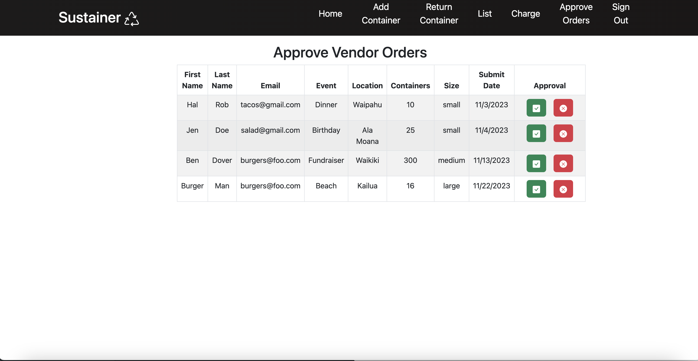
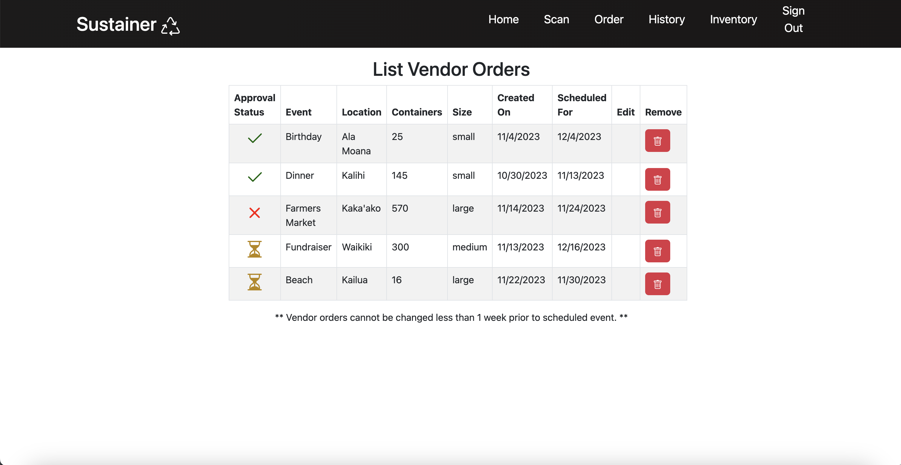
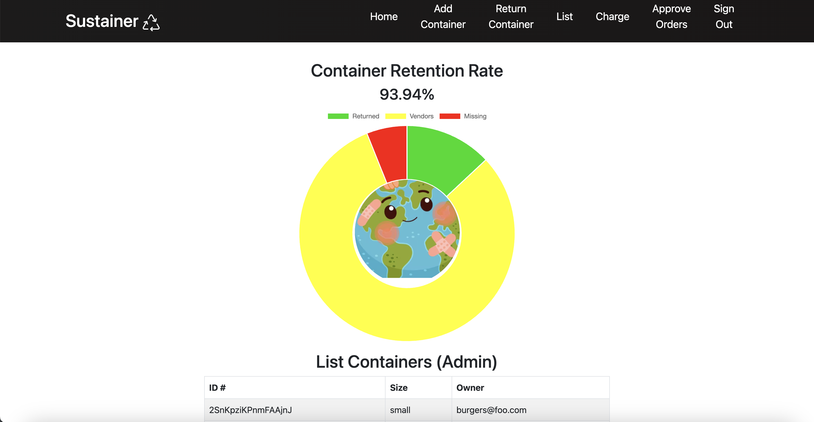

## Background Information

Sustainer was the final project developed in my ICS 314 class, which focuses on understanding software engineering fundamentals and developing proper development practices. The project consisted of 5 group members, each with our own distinct roles and tasks in order to complete a functional,full stack application. More details are provided below. 

  

## Project Overview & Details

Sustainer is a web app that allows easy access to rent and keep track of containers at large public events. The idea behind this app is to support a circular economic system when consumers order food at food trucks and other vendor locations. This is proposed through the implementation of using reusable containers at events, such that users can return these containers after eating their food. <a href="https://www.zerowasteoahu.org/" target="_blank">**Zero Waste Oahu**</a> (ZWO) is a nonprofit organization that has promoted this idea for a cleaner and stronger impact on the environment. The main problem, however, is that ZWO only receives a 60% return rate for these reusable containers at public events, which include beach cleanups, farmers market shops, and other fundraisers. As a result, it is very difficult to continue reusing these containers for future events when not all of them are being properly returned. 

Sustainer aims to solve this problem by holding users accountable for containers that aren't returned via a collateral-accountability system. The app also allows members of the ZWO organization to keep track of any containers that are in use, or have been returned, by users. Doing so will keep the environment sustainable on the community level. It will also help improve the economic system that is envisioned by ZWO. 

The overall solution revolves around the concept of "transferring ownership" of the reusable containers throughout the process or cycle of ordering food at an event. In order to uniquely identify users, QR codes are created from a consumer's personal account. Upon ordering takeout from a vendor, users will scan their QR ID. Vendors will then scan the container with their food to link the associated container to that specific user. Users will then return the container in an appropriate ZWO bin. At the end of the event, organizers will scan these containers back in to reassign the container to admin owners. Containers that are still associated with a user or unaccounted for will charge the user a certain flat fee of $5 per container. Therefore, the app is  intended for 3 main audiences and consists of the following purposeful functions:
* **Users**: Create an account to get their QR Code and link a payment method as collateral
* **Vendors**: Order containers from ZWO for specific events and view the inventory of containers. Scanning of containers for ownership can also be done here.
* **Admin / Moderators**: Scan and check containers back in. There are also options to charge a user for a container and add new containers to the database.

In terms of the technological toolsets, the app uses Meteor as the main stack for our web app development framework. React Bootstrap was used as UI frameworks for front-end development. JavaScript was the programming language used for coding, along with React hooks to add functionalities and enhance the user interaction experience (UX) on the website. IntelliJ Idea was used as the coding environment, with ESLint implemented for coding standard practices and quality code assurance. Project/configuration management was utilized through GitHub and the app was deployed via Digital Ocean.

You can view and test out our deployed app <a href="https://sustainer.online/" target="_blank">**here**</a>. _However, please note that as of February 2024, the app may be unavailable due to the removal of the deployed servers_. In this case, please see the **Download and Installation** section in the  <a href="https://sus-tainer.github.io/#installation" target="_blank">**documentation here**</a> to run the app locally.

## Roles & Contributions

I was mainly responsible for designing the general data model and structure for the backend portion of our app. This included coming up with proper relational databases and tables to accurately pull data from. I initially encountered setbacks in how the transfer of ownership would work with the reusable containers. It was difficult to consider how to link or associate the containers to a specific user's QR and payment method. A workaround for this involved the creation of joined collections between a container and its owner of a consumer, admin, or vendor respectively. Ultimately, however, our team decided to create customized roles in the default <a href="https://guide.meteor.com/accounts" target="_blank">**Meteor Accounts**</a> collection to associate a user with a container. By assigning roles in this way, ownership can be easily updated in the collection through customized Meteor methods and React hooks. After creating the initial data model, I then worked on establishing the proper publications and subscriptions for MongoDB/ Minimongo to fetch or pull from on both the server and client sides respectively. From there, I made sure that all functionalities and routes were correct in our web pages by implementing test pages via TestCafe. This can be seen via our **continous integration** badge in the documentation at the bottom of this page. After working on these issues, I set up and monitored the deployment of our app using Digital Ocean.

On a more functional and implementation standpoint, I also helped with properly listing the data from the database in the form of tables. These include the "Containers List" page and "Approve Vendor Orders" page for administrators, as well as the "List Vendor Orders" page for vendors. These pages show all the available containers at a specific event, a verification for pending orders, and a "purchase" history of orders accordingly. I first started by subscribing to the proper publication to fetch the necessary data. I then used React Bootstrap tags and Bootstrap icons to display the wanted information. 

For pages dealing with vendor orders, I later incorporated an approval status element, so that vendors can visually know if an admin has approved their order of containers. From there, I worked on correctly implementing a submit function that will update the status if edits are made to an existing order, or if new orders are created. 

In the Containers List page, I utilized a graph library to display a visual pie chart graphic of the container retention rate. I also found some appropriate graphics that dynamically adjusts to the retention percentage. Ultimately, I think that adding this graphic made the page more user-friendly in displaying the information for admin users.

Here are some screenshots to some of the pages that I contributed to:

 
 
 
 

 
 

## Learning Points from Project

This project was presented at the 2023 <a href="https://www.zerowasteoahu.org/" target="_blank">**Hawaii Annual Coding Challenge**</a> (HACC) for the unique solution that our team had come up with. Although our team didn't end up winning the challenge, I found the whole process of designing, implementing, and presenting our solution to be a good experience. I look forward to participating in more similar coding challenges in the near future, in order to advance both my technical skills and problem-solving abilities for real-world issues. This project also emphasized the importance of working effectively in a group setting, which helped me acquire new knowledge of team-building and communication aspects.

From this project, I was able to further my knowledge on the concept of functional programming in JavaScript, in which functions are first-class. I was also able to write code using shortcut syntax related to JavaScript. More importantly, however, creating a full stack web app for the first time allowed me to practice the software engineering fundamentals that I have gained from this ICS 314 class. I also feel like I have enhanced my learning in technical aspects. As an example, I have learned how the Meteor data model works in terms of creating publications and subscriptions. This equivalently applies to the concept of clients viewing data on their end through the pulling of chunks of data on the server side. I have also learned how to use tags from React Bootstrap to adjust and align elements on a page in a much simpler manner. Incorporating one's own CSS styling can further make a cohesive and aesthetic user interface. Hence, as a result, I have expanded my abilities in utilizing web app and web UI frameworks. 

In a more general sense, going through the entire process of creating an entire project, which includes planning, designing, programming, testing, and implementing the code, made me learn that constant incremental changes in small portions are required to improve the quality of an app.  cohesive fully functional, meaningful , important/key app/impactful, with a team intangible soft skills that I need to work on. Communication is obviously a significant component in group work and a main takeaway from this experience.

### Improving the App

There are definitely some improvements that can be made to this app, such as adding filters and searches for each of the list of tables. Adding a page that lists all containers a specific user is assigned to from the perspective of a user/consumer account can also be beneficial. Incorporating these functions will enhance the UX and make the website more user-friendly. In terms of UI design, adding some CSS styling to the tables can create more of a professional and consistent look to the theme of the website. It can also make the app look more visually cleaner and simpler in its layout.

 

#### Links 

* View our deployed app: <a href="https://sustainer.online/" target="_blank">**Sustainer**</a>
* View our source code: <a href="https://github.com/sus-tainer/sustainer" target="_blank">**Repository on GitHub**</a>
* Read more about our project: <a href="https://sus-tainer.github.io/" target="_blank">**Organization Home Page & Project Documentation**</a>
